# Common Functions

## Dialog Controls

LAD has several dialogs, such as New Radio Log, New Ops Log and the Incident Timeline. They share common hotkeys:

| Keys | Action |
| --- | --- |
| <kbd>Ctrl</kbd>/<kbd>Cmd</kbd> + <kbd>Enter</kbd> | Submit the dialog |
| <kbd>Esc</kbd> | Close the dialog |
| <kbd>Ctrl</kbd>/<kbd>Cmd</kbd> + <kbd>K</kbd> | Open the Spotlight menu (can be changed under [Appearance](configuration.md#appearance)) |

## Spotlight Menu

Open the Spotlight menu with <kbd>Ctrl</kbd>/<kbd>Cmd</kbd> + <kbd>K</kbd>. It searches incidents and teams within your LAD filters. Selecting a result takes you to that incident or team in its register and zooms the map to it (if it is on the map).

**Searchable incident fields:** ID, type, status, assigned HQ, LGA, assigned sector, address, tags, situation on scene, caller and contact details.

**Searchable team fields:** callsign, assigned HQ, team leader's name, team members' names.

## Spotlight Commands

Spotlight also accepts commands. Type the command name (e.g. `task`) and then provide the information it asks for. The command instructions appear under the search box once the command name is recognised.

### Task Team command — `task`

Tasks a team to an incident. You need to provide a team and an incident, in either order.

1. Type `task`. The command instructions appear.

   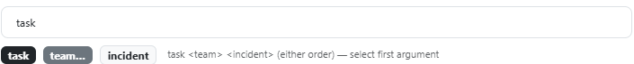

2. Start typing the team's name. LAD tries to match your text to a single team — enter enough of the name to match just one, or select it from the results. You can search by any searchable team field. When matched, the **team** part of the instructions turns green.

   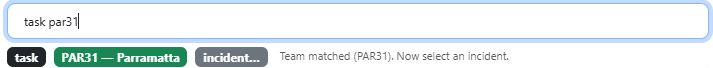

3. Search for the incident using any searchable incident field, such as ID or address. When matched, the **incident** part turns green.

   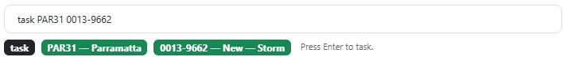

4. Press <kbd>Enter</kbd> to open the tasking menu.

### Radio Log command — `radio`

Creates a radio log against a team on an incident. Works the same way as `task`: provide a team and an incident, in either order.

1. Type `radio`.

   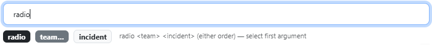

2. Type the team's name until the **team** part turns green.

   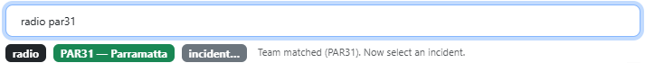

3. Search for the incident until the **incident** part turns green.

   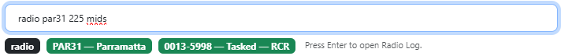

4. Press <kbd>Enter</kbd> to open the [New Radio Log](#new-radio-log) dialog.

### Ops Log command — `log`

1. Type `log`.

   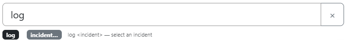

2. Select the incident from the list, or search by its address, situation on scene, headquarters or incident ID. The **incident** part turns green when matched.

   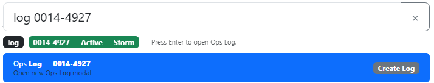

3. Press <kbd>Enter</kbd> to open the [New Ops Log](#new-ops-log) dialog.

### Find Asset command — `find`

Finds any trackable asset, including ones not matched to a team, and zooms the map to it.

1. Type `find` followed by part of the asset's callsign, PSN radio ID or satellite ID (e.g. `find ctn7`).
2. Matching assets are listed with their capability, type, HQ, PSN ID and when they were last seen. Callsigns that start with what you typed come first.
3. Press <kbd>Enter</kbd> (or click an asset) to zoom to it and open its popup. If its asset layer is hidden, LAD turns it on.

## Starring Incidents and Teams

You can star incidents and teams in each register, then toggle the register between all filtered items (the default) and only starred items.

Star or un-star an item by clicking the star button on its row; a starred item's star appears larger.

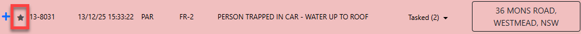

Switch views with the **Toggle Starred** button described in [Register Controls](interface.md#register-controls). Clear starred items from the [Starred](configuration.md#starred-teams--incidents) configuration tab.

## Listing Only What's in the Map View

Each register can be narrowed to only the incidents or teams inside the current Situation Map view. This is useful when you're zoomed in on one area and want the registers to match what you can see on the map.

Click the **Toggle In Map View** button (map icon, next to **Toggle Starred**) in the register's controls. While it's on, the button is highlighted and the register heading shows how many items are listed out of all filtered items, e.g. **Incidents (4/13)**.

The list updates as you pan and zoom the map.

- An **incident** is in view when its address is inside the map view. Incidents without a geocoded location aren't listed while the toggle is on.
- A **team** is in view when any of its [matched radios or satellite trackers](team-register.md#matched-assets) is inside the map view. Teams without a matched radio or satellite tracker aren't listed while the toggle is on.

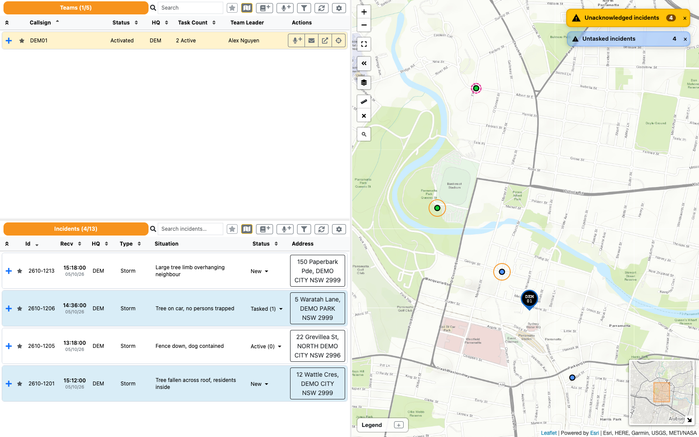

> **Note:** This only changes the register lists. The map still shows every filtered incident and team, and [alerts](interface.md#alerts) still count everything that matches your filters.

Each register's toggle is separate and works alongside **Toggle Starred** and the register search. LAD remembers the setting on this computer; **Restore Defaults** on the [Configuration](configuration.md) screen turns it off.

## New Radio Log

Clicking a **Radio Log** button opens the New Radio Log dialog. The title shows the team's callsign, plus the incident ID if opened against an incident.

- Clicking Radio Log against a **team on an incident** creates the log against that incident.
- Clicking Radio Log against the **team** itself does not associate it with an incident.

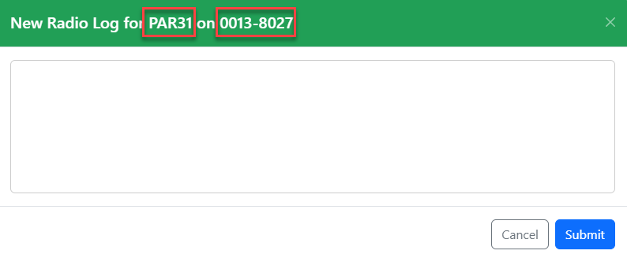

Clicking **Submit** creates a new ops log entry. The subject is the team's Beacon name followed by your message, and the entry has the *Radio* tag applied. If created against an incident, it is visible in that incident's *Notes* / *Ops Log Entries*.

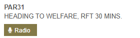

## Send SMS

Clicking an **SMS** button opens the Send SMS dialog, listing every team member and their SMS number from their Beacon contact details.

Choose recipients with the checkbox next to each member, then click **Send**. Setting **Operational** to *Yes* marks it as an operational SMS in the Beacon message register.

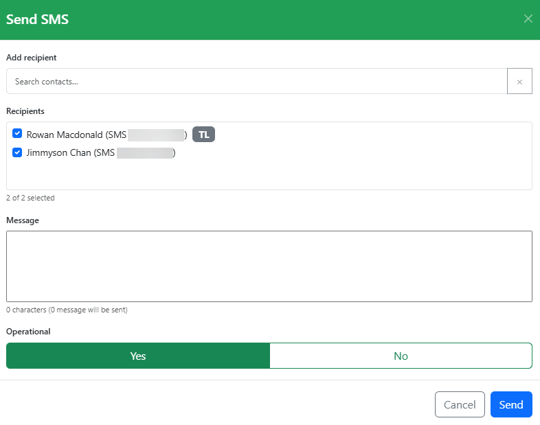

### Sending SMS for an Incident

If you click Send SMS against a team tasked to an incident, the message is pre-filled with the incident ID and address. Messages sent against an incident also appear in that incident's *Messages* section.

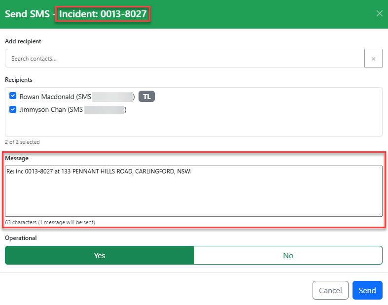

### Adding Additional Recipients

Add recipients by searching in the **Add recipient** field — individual members by name or member number, or contact groups by group name. The search covers all members and contact groups statewide.

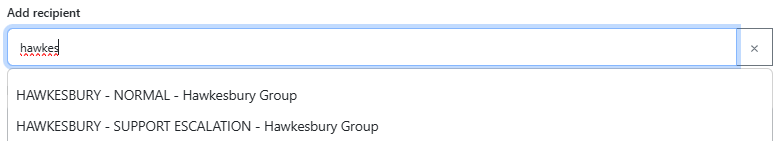

## New Ops Log

Clicking an **Ops Log** button opens the New Ops Log dialog. It works the same way as Beacon notes: select tags, enter a subject and text. If opened from an incident it is automatically attached to that incident. You can also enter a team to pre-fill the subject with the team's name.

You must select at least one tag and enter text before clicking **Submit**.

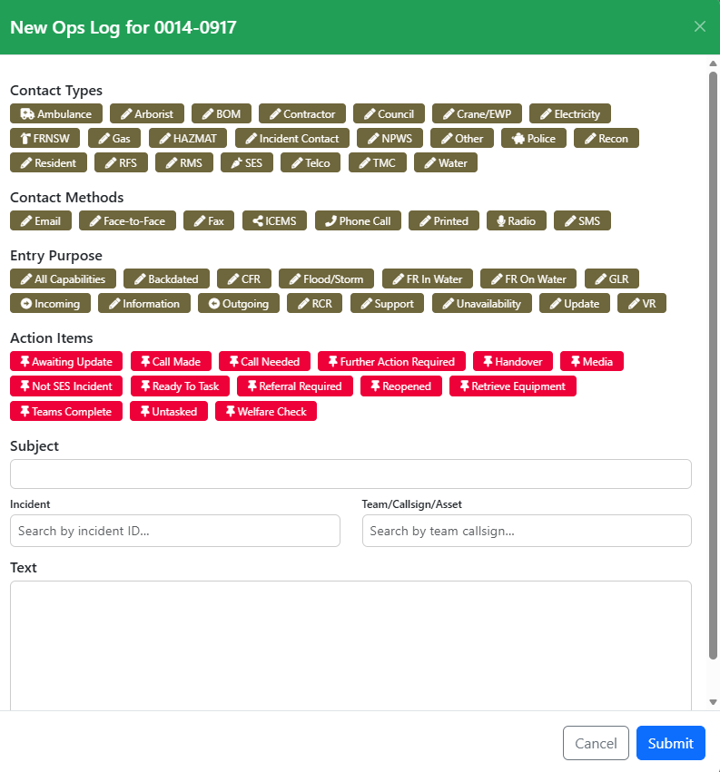

## Tasking Teams (Instant Task)

Clicking **Task Team** opens the Instant Task dialog, which lists filtered teams. Use the search bar to find a team by name. Teams are ordered by distance to the incident (geocoded incidents only — distance is calculated from the team's primary matched asset).

Each team shows:

- Number of current taskings and the types of tasked incidents (flood rescues also show their category)
- Distance (straight line)
- Compass bearing from the incident

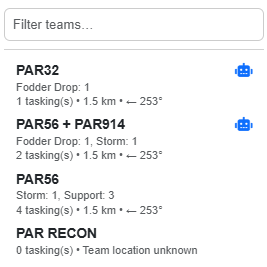

### Instant Task Suggestions

Teams marked with a blue robot icon  are **Instant Task Suggestions**. LAD picks the most appropriate team using the rules and weightings set under [Instant Task Suggestions](configuration.md#instant-task-suggestions), which differ for rescue and non-rescue incidents. For example, rescue incidents prefer teams with no active taskings, so a suggestion may be geographically further away.

### Tasking the Team

Clicking a team shows a confirmation with three options:

- **Cancel**
- **Task & SMS Details** — tasks the team and opens [Send SMS](#send-sms) addressed to the team, pre-filled with the incident details (similar to the message Beacon generates when creating an incident).
  - Cancelling the SMS only cancels the SMS — the team is still tasked.
- **Task**

### Drag & Drop Team Tasking

Drag an incident from the Incident Register onto a team in the Team Register to task that team. Click and hold on the blue **+** / **−** icon at the left of the incident row, then drag it onto a team row.

Incident popups on the Situation Map can also be dragged onto a team in the Team Register.
