# Configuration

When you first launch LAD you are taken to the **Configuration** screen, where you configure the settings and filters LAD uses. You can re-open it at any time with the **Page Configuration** button in either register (see [Register Controls](interface.md#register-controls)).

The settings are split into tabs down the left: **Data**, **Filters**, **Map markers**, **Collaborative layers**, **Layout**, **Starred**, **Appearance** and **Instant Task Suggestions**. At the bottom of the tabs, **Trackable Asset Library** saves your settings and opens the [Trackable Assets Library](interface.md#trackable-assets-library), and **User guide** opens this guide in a new tab.

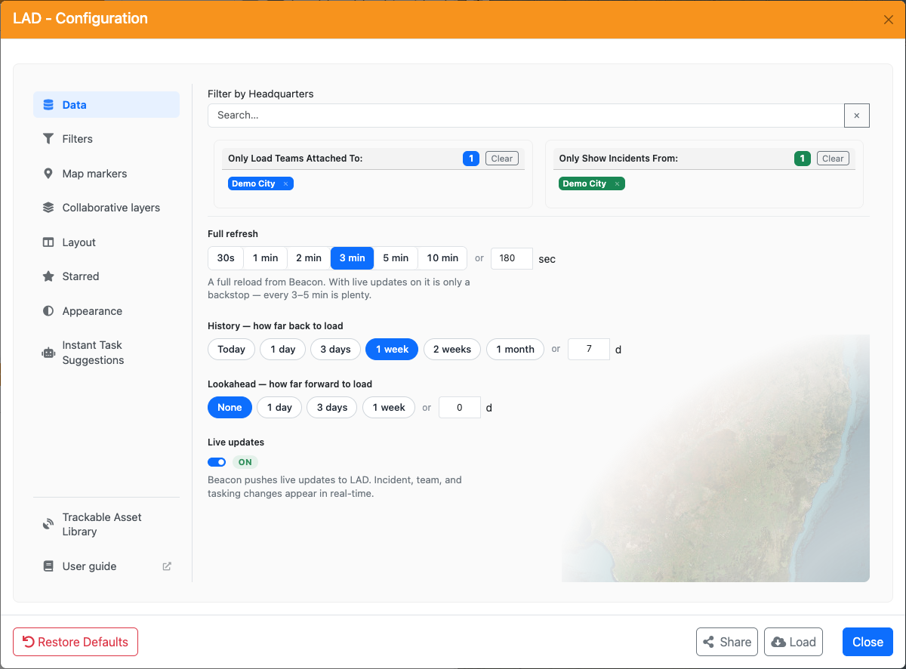

## Data Settings

The Configuration screen opens on the **Data** tab. It sets the primary filters that govern what data is synced into LAD.

### Headquarter Filters

Filter your teams and incidents to specific headquarters. If no headquarters are selected, data from **all** headquarters is synced.

You can have different HQ filters for incidents and teams, but it is **recommended** to keep them identical for normal operations.

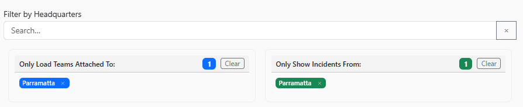

#### Adding Headquarters

Type the headquarters name into the search field. Click anywhere on the headquarters name to add it to **both** the Teams and Incidents filters, or click the **Teams** or **Incidents** button at the right of the row to add it to only that filter.

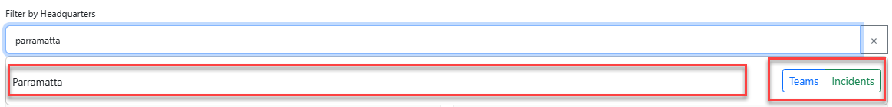

#### Expanding Headquarters

If you select a zone, you can expand it to include all units under the zone. This works the same way as the zone expand feature in the Beacon headquarters filter.

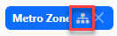

#### Clearing Headquarters

To remove a headquarters from a filter, click the cross next to it. To remove all headquarters, click the **Clear** button above the list of selected headquarters.

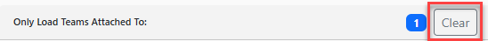

### Full Refresh Interval

How often a full reload of data from Beacon occurs. The default is **3 minutes**. With Live Updates on, you shouldn't need to sync more often than that.

### History

How far back to load data. The default is **1 week** — incidents and teams older than one week are not synced into LAD.

### Lookahead

Whether incidents or teams created in the future are synced into LAD. The default is **None**.

### Live Updates

When information is updated in Beacon, it is pushed directly into LAD, giving near real-time updates to incidents, teams and tasking statuses. Each register's **Refresh Data** button flashes when an update for it arrives (see [Register Controls](interface.md#register-controls)).

> **Note:** When using Live Updates, keep the Full Refresh Interval between 3 and 5 minutes. The full refresh picks up anything Live Updates missed.

## Filter Settings

The **Filters** tab gives more granular control over which incidents and teams are synced into LAD.

### Incidents

Choose which incident statuses and types are synced. Only incidents whose status **AND** type are both selected are synced.

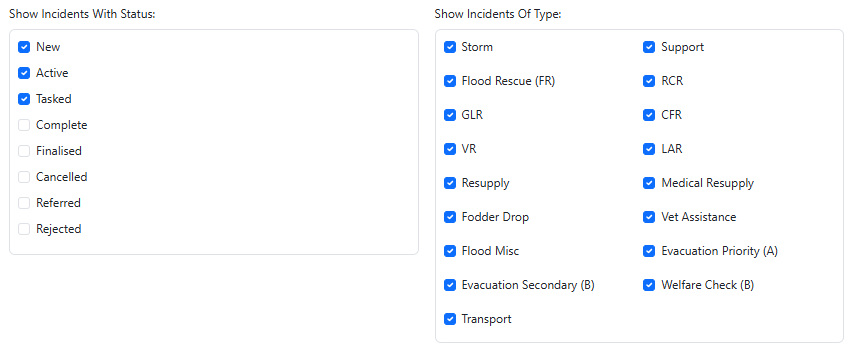

### Teams

Choose which team statuses, team types and tasking statuses are synced. Only teams whose status **AND** type are both selected are synced.

Taskings are only displayed under teams when they match the selected tasking statuses.

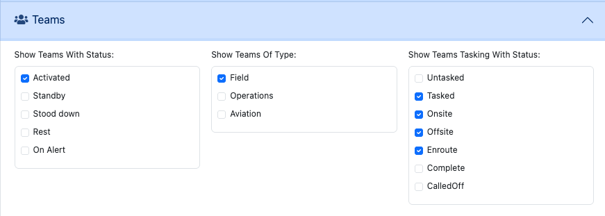

### Sectors

Control which incidents and teams appear based on their sector.

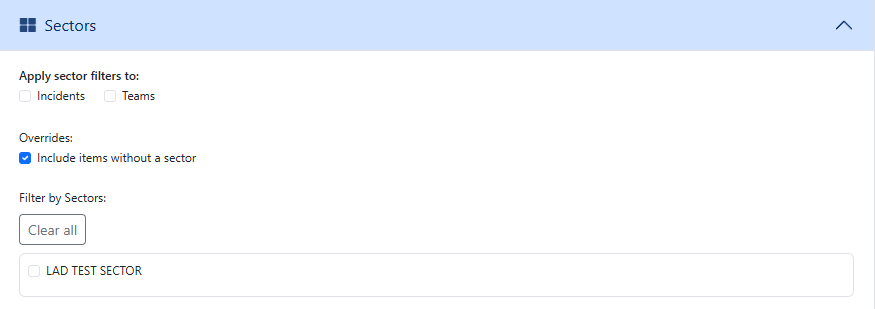

- **Apply sector filters to** — tick **Incidents** and/or **Teams** to choose what the sector filter applies to.

  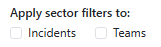

- **Include items without a sector** — on by default. Incidents and teams with no sector assigned are always synced.

  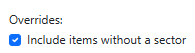

- **Filter by Sectors** — select the sectors to sync. Only sectors for the headquarters selected in [Data Settings](#headquarter-filters) are available.

## Map Markers

The **Map markers** tab controls how incident and asset markers are displayed and the order layers are drawn on the map. Its settings are grouped into three sections, **Incident markers**, **Asset markers** and **All markers**. Click a section to open it; opening one closes the others.

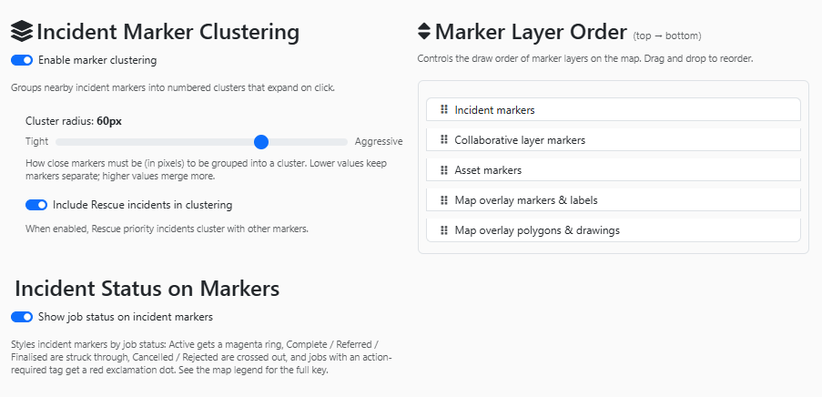

### Incident Markers

#### Incident Marker Clustering

When enabled, markers that are close together on the map are grouped into a cluster to reduce clutter.

- **Cluster radius** — how close markers must be (in pixels) to cluster. The default is **60px**. Lower values keep markers separate; higher values cluster more.
- **Include Rescue incidents in clustering** — whether rescue incidents can be clustered with other markers.

See [Incident Clustering](situation-map.md#incident-clustering).

#### Incident Status on Markers

When enabled, LAD adds extra indicators to incident markers so you can see incident status, and any unresolved action required tag, at a glance. See [Incident Status on Markers](situation-map.md#incident-status-on-markers).

### Asset Markers

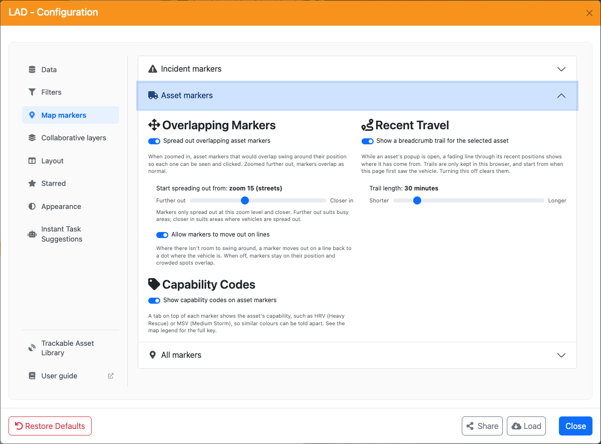

#### Overlapping Markers

- **Spread out overlapping asset markers** (on by default). When zoomed in, asset markers that would overlap swing around the vehicle's position so each one can be seen and clicked. Zoomed further out, markers overlap as they always have. See [Overlapping Asset Markers](situation-map.md#overlapping-asset-markers).
- **Start spreading out from** sets the zoom level markers start spreading out at. The default is **zoom 15 (streets)**. Slide towards **Further out** (down to zoom 13, suburbs) if you work in a busy area and want markers separated sooner, or towards **Closer in** (up to zoom 18) if vehicles in your area are usually well apart.
- **Allow markers to move out on lines** (on by default). Where there isn't room for a marker to swing around its position, it moves out on a line back to a dot where the vehicle is. Turn this off to keep every marker on its position; crowded spots then overlap.

These options only show while **Spread out overlapping asset markers** is on.

#### Recent Travel

- **Show a breadcrumb trail for the selected asset** (on by default). While a vehicle's popup is open, a fading line through its recent positions shows where it has come from. See [Asset Breadcrumb Trails](situation-map.md#asset-breadcrumb-trails). Trails are kept only in this browser. Turning this off clears them.
- **Trail length** sets how far back the trail goes, from **15 minutes** to **2 hours**. The default is **30 minutes**. Vehicles report their position every few minutes, so a longer trail shows more of the route.

#### Capability Codes

- **Show capability codes on asset markers** (on by default). A tab on top of each asset marker shows the asset's capability as a short code, so capabilities with similar colours can be told apart, such as the rescue tiers and Community First Responder. The map legend lists each code next to its capability:

  | Code | Capability | Code | Capability |
  | --- | --- | --- | --- |
  | BUS | Bus | HRV | Heavy Rescue |
  | CMD | Command | GLR | General Land Rescue |
  | CCV | Corporate Command | SHQ | SHQ Pool / Pool Vehicle |
  | CFR | Community First Responder | VES | Vessel (class not known) |
  | GPV | General Purpose | PRT | Portable |
  | LOG | Logistics | HCV | High Clearance |
  | STM | Storm | SUP | Support |
  | LSV | Light Storm | COW | Cell on Wheels |
  | MSV | Medium Storm | SAV | Strategic Asset |
  | LRV | Light Rescue | VC1–VC4 | Vessel, Class 1–4 |
  | MRV | Medium Rescue | | |

  Assets with any other capability, or none, have a grey marker and no code.

### All Markers

#### Marker Layer Order

Controls the order map elements are drawn. Items at the top of the list are drawn over items lower down. Drag to rearrange. The default order (top to bottom) is:

1. Incident markers
2. Collaborative layer markers
3. Asset markers
4. Map overlay markers & labels
5. Map overlay polygons & drawings

## Collaborative Layers

Collaborative layers hold custom map markers that other users can see. You can create, view and edit multiple collaborative layers at once.

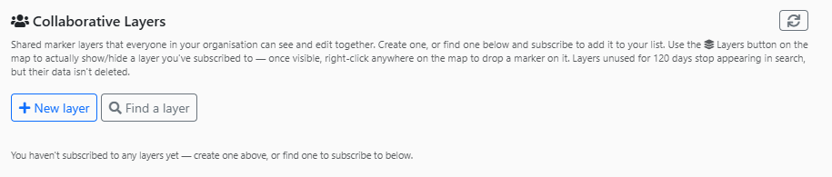

### Subscribing to a Layer

1. Click **Find a layer**. You'll see all layers for the selected headquarters. Click the **X** to remove the headquarters and choose a different one, or leave it blank to search all headquarters.
2. Click **Subscribe** next to the layer you want.

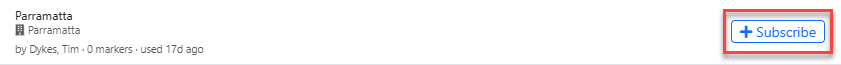

### Creating a New Layer

Click **New layer**, enter a layer name and select the headquarters the layer belongs to.

Expand **Advanced options** for more settings:

- **Attach to event** — attach the layer to a specific event.
- **Marker permissions** — who can add, modify and delete markers on the layer.
- **Delete permissions** — who can delete the layer.
- **Comment permissions** — who can comment on markers on the layer.

If any setting gives permissions to moderators, a **Moderators** box appears. Add moderators by searching for their name or member number.

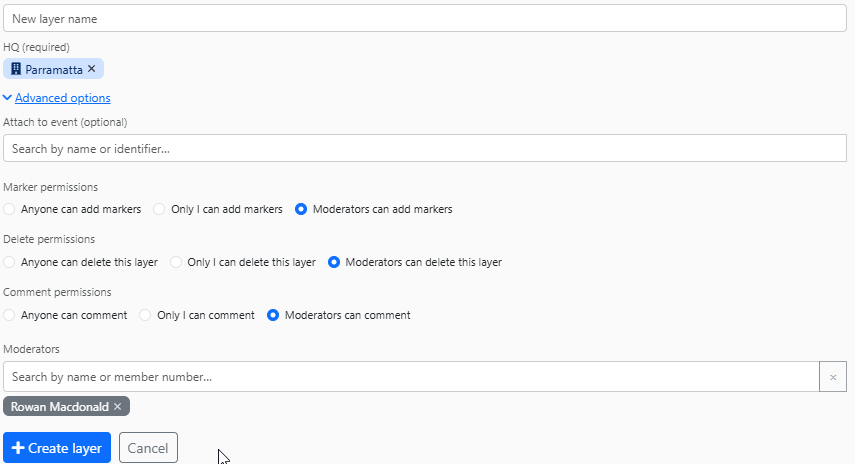

See [Collaborative Map Layer](situation-map.md#collaborative-map-layer) for using layers on the map.

## Layout

Choose a preset layout for LAD — which side the map is on, whether teams or taskings are on top, single-pane layouts, or map only.

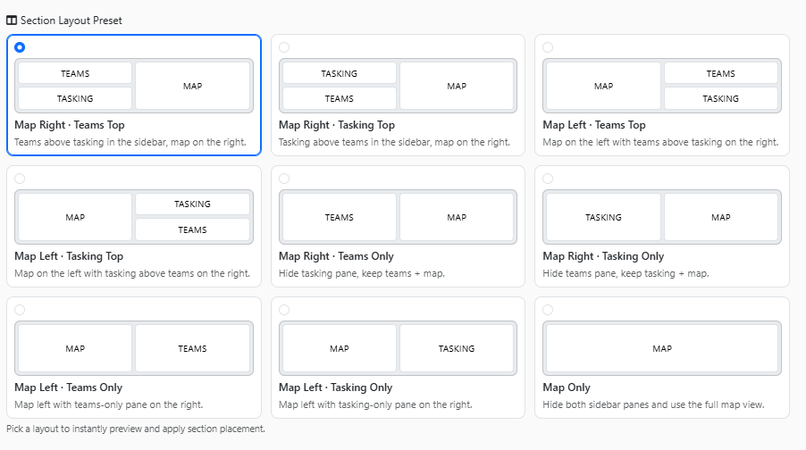

## Starred Teams & Incidents

View all [starred](common-functions.md#starring-incidents-and-teams) teams and incidents. Use the **Clear** buttons to clear starred teams or incidents, or **Clear all Starred** to clear both.

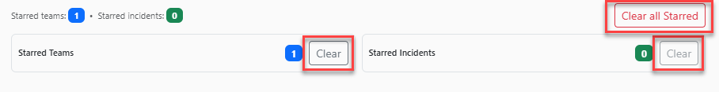

## Appearance

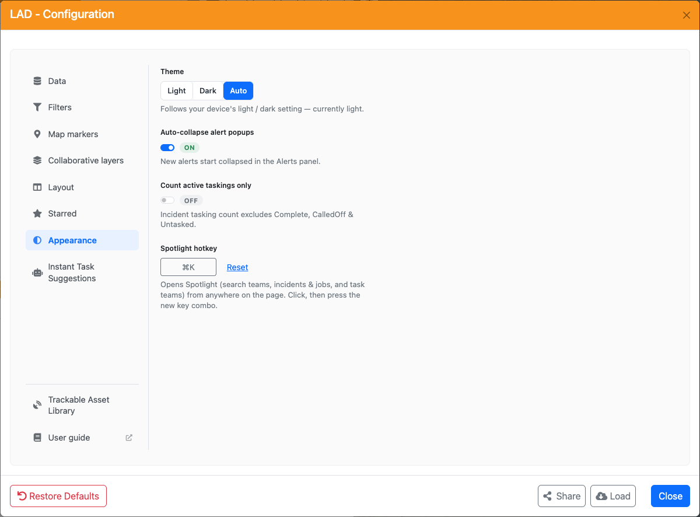

- **Theme** — Light, Dark, or Auto (follows your browser setting).
- **Auto-collapse alert popups** — when enabled, all [alerts](interface.md#alerts) start collapsed when the page loads.
- **Count active taskings only** — when enabled, *Complete*, *CalledOff* and *Untasked* statuses don't count towards a tasking count.
- **Spotlight hotkey** — the key combination that opens the [Spotlight menu](common-functions.md#spotlight-menu). Click the field and press the new combination, or click **Reset**.

## Instant Task Suggestions

When enabled, LAD suggests a team when you [task an incident](common-functions.md#tasking-teams-instant-task). Suggestions are based on each team's distance and tasking count — they **do not take team capabilities into account**.

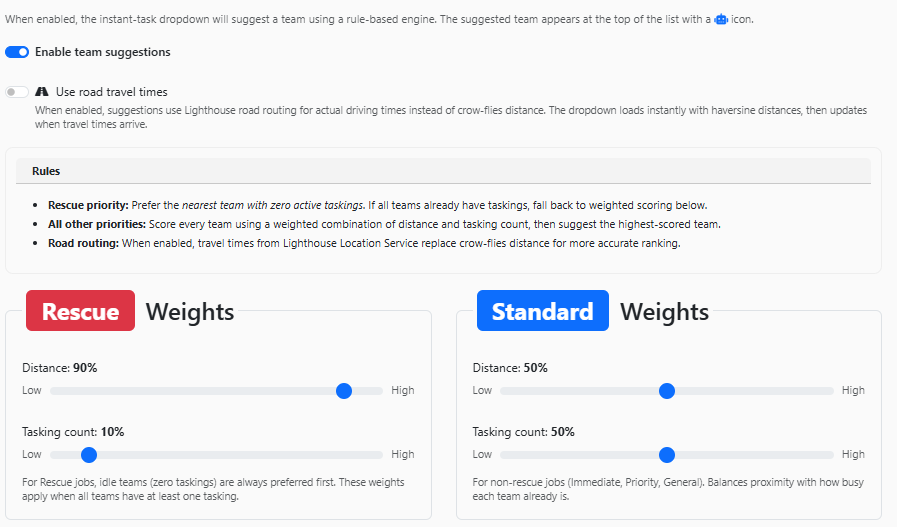

- **Rescue priority** — the nearest team with zero active taskings is preferred. If every team already has a tasking, LAD falls back to the weighted score.
- **All other priorities** — every team is scored on a weighted combination of distance and tasking count, and the highest-scoring team is suggested.

### Use Road Travel Times

When enabled, distance comes from an estimated driving time instead of straight-line (as the crow flies) distance. The list shows straight-line distances straight away, then updates when travel times arrive.

### Weights

Set separate weights for **Rescue** and **Standard** (non-rescue) incidents, balancing the importance of distance against tasking count.

## Sharing Configurations

**Share** generates a code that captures your current filters and settings. Another user can click **Load**, enter the code and click **Go** to apply the same configuration.

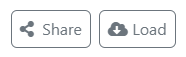

## Restoring Default Settings

**Restore Defaults** resets all filters and configuration settings to their defaults, and removes any starred incidents and teams.

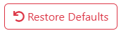
