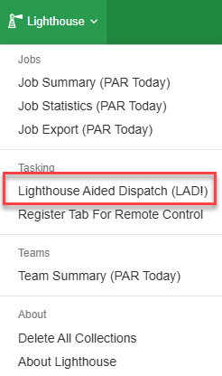
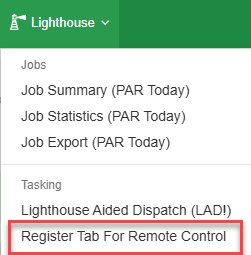
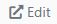
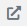
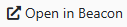
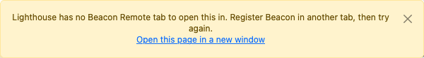
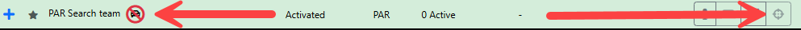

# Getting Started

## Launching LAD

To launch LAD, open the **Lighthouse** navigation menu in Beacon and select **Lighthouse Aided Dispatch (LAD!)**. LAD opens in a new browser tab.

When you first launch LAD you are taken to the [Configuration](configuration.md) screen.

## Remote Beacon Tab

LAD does not contain every Beacon function, so you will still need Beacon for some tasks. The remote tab feature tells LAD which Beacon tab to open incidents and teams in, so you can choose the tab, browser window or screen that Beacon opens on.

### Setting the Remote Tab

Open Beacon in a new tab. Under the **Lighthouse** navigation menu, click **Register Tab For Remote Control**. That tab is now the remote tab for LAD.

This works in split screen, a different browser tab or a different browser window. It must, however, be the **same browser application** that LAD is open in — you cannot set the remote tab in Edge if LAD is open in Chrome (and vice versa).

### Opening pages in the Remote Tab

Buttons throughout LAD open the selected item in the full Beacon page, in the remote tab. These are identified by the *Open in remote tab* icons:

  

When you click an *Open in remote tab* button, the incident or team opens in the remote tab you set previously.

If LAD can't use a remote tab, it shows a warning explaining why, with an **Open this page in a new window** link so you can still get to the page. This happens when:

- no remote tab has been registered,
- the remote tab has since been closed, or
- the tab LAD is open in is itself registered as the remote tab.

The warning stays until you close it or click the link. To go back to opening pages in a remote tab, [set the remote tab](#setting-the-remote-tab) again.

## Setting up a Team for Radio Tracking

LAD uses the Beacon **team name** to work out which radio to track. Where a callsign in a team name is an exact or close match to a PSN radio name, that radio is tracked against the team. Radio names can be looked up in the [Trackable Assets Library](interface.md#trackable-assets-library).

**Key points:**

- Radios are matched to teams by their **PSN Radio Name**.
- Each team has a **primary matched asset**, used for location-based features like tasking suggestions.
  - It is shown in the [expanded Team Register](team-register.md#matched-assets) as the matched asset with a star against it. It can be changed by the user and is synced to all LAD browsers.
- A team can have multiple radios — include each callsign in the team name.
  - e.g. `PAR56 + PAR913` tracks both radios against the team (if they exist and match the PSN radio name).
- Exact matches take priority.
  - If the PSN radio name is `PAR56` and the team name includes `PAR56`, it is an **exact match**.
- With no exact match, the closest radio name is used.
  - If the PSN radio name is `PAR32` and the team name includes `PAR 32`, it matches as the **closest match**.
  - If the team name is `PAR3`, it matches the closest radio name, which could be `PAR31`, `PAR32` or `PAR33`.
- Each callsign in a team name can only be matched once.
  - If the team name includes `PAR3` and the closest match is `PAR31`, only `PAR31` is tracked.
- Team names can still contain other text — but any text that is similar enough to a radio name will match.
  - e.g. `PAR56 + PAR741 – Day Shift 2 IWO` works.

**Examples:**

- `PAR-56 + PAR741` matches the PAR56 vehicle radio and PAR741's boat radio. `PAR56 & PAR741` and `PAR56 Response with vessel PAR741` also work.
- `Parramatta 56 + Parramatta 741` will **not** match, as there is no PSN radio named like `Parramatta 56` or `Parramatta 741`.

### Unmatched Teams

Teams not linked to a radio asset show a location marker with a cross through it, and their focus button is greyed out.

### Troubleshooting radio matching

**Initial checks:**

- Confirm the team is **Activated** in Beacon.
- Confirm the team appears in the LAD Team Register.
- Confirm the name of the radio the team should match in the [Trackable Assets Library](interface.md#trackable-assets-library) (Team Register filter menu, or the bottom of the Configuration tabs).
- Confirm the radio is turned on.

**Incorrect or non-standard radio names:** Some radios have names that don't follow the statewide format. In the **Layers** menu, under **Assets**, enable **Unmatched against Teams**. This shows all recently active radios so you can confirm the radio's name and update the team name to suit. You can also check the Trackable Assets Library from the Team Register filter menu.

**Radios not reporting location:** If a radio isn't checking in or updating its GPS location, contact the Service Desk. As a temporary fix for vehicle radios, the team can turn on a portable radio and you can add the portable's name to the team name so it is tracked instead. Make sure the portable stays on even when in the vehicle (the volume can be turned all the way down).
