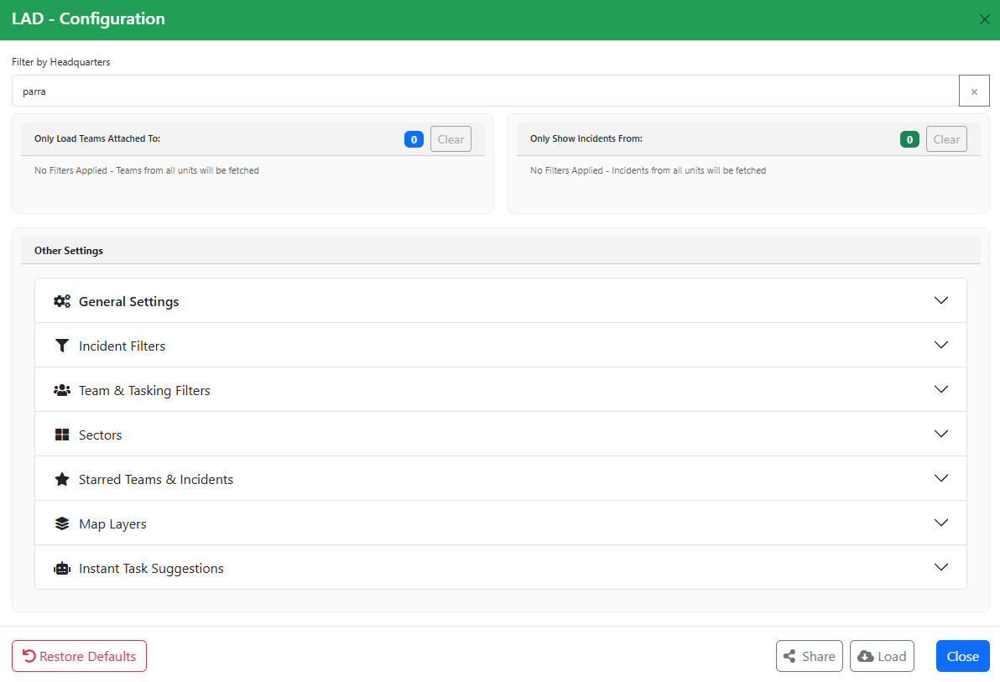
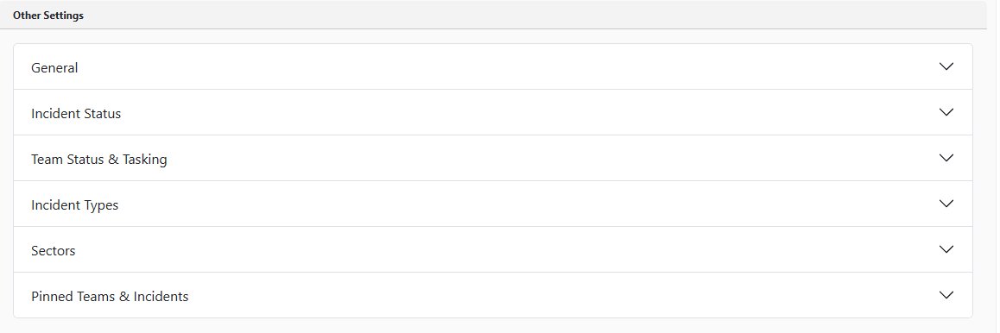

# Getting Started

## Launching LAD

To launch LAD, open the **Lighthouse** navigation menu in Beacon and select **Lighthouse Aided Dispatch (LAD!)**. LAD opens in a new browser tab.

## Remote Beacon Tab

LAD does not contain every Beacon function, so you will still need Beacon for some tasks. The remote tab feature tells LAD which Beacon tab to open incidents and teams in, so you can choose the tab, browser window or screen that Beacon opens on.

### Setting the Remote Tab

Open Beacon in a new tab. Under the **Lighthouse** navigation menu, click **Register Tab For Remote Control**. That tab is now the remote tab for LAD.

This works in split screen, a different browser tab or a different browser window. It must, however, be the **same browser application** that LAD is open in — you cannot set the remote tab in Edge if LAD is open in Chrome (and vice versa).

### Opening pages in the Remote Tab

Buttons throughout LAD open the selected item in the full Beacon page, in the remote tab. These are identified by the *Open in remote tab* icon.

<!-- TODO: screenshot of the "Open in remote tab" icon -->

When you click an *Open in remote tab* button, the incident or team opens in the remote tab you set previously.

## Configuring LAD

### Page Configuration & Filters

When you first launch LAD you are taken to the **Page Configuration** screen, where you set filters so LAD only includes the teams and incidents you need.

#### Headquarter Filters

The headquarters filters limit your teams and incidents to specific headquarters. Type a unit or zone into the search box to find it:

- Clicking the row adds the headquarters to **both** the Teams and Incidents filters.
- The **Teams** and **Incidents** buttons add the headquarters to only that filter.

Only incidents and teams for headquarters in the relevant filter are displayed in LAD. Having no headquarters selected loads incidents and teams from **all** HQs.

#### Expanding Headquarters

If you select a zone, you can expand it to include all units under the zone. This works the same way as the zone expand feature in the Beacon headquarters filter.

#### Clearing Headquarters

To remove a headquarters from a filter, click the cross next to it. To remove all headquarters, click the **Clear** button above the list of selected headquarters.

#### Other Settings

The **Other Settings** section of the page configuration contains additional filters and settings.

##### General

| Setting | Description | Default |
| --- | --- | --- |
| Refresh Interval (s) | How often team and incident data is fully refreshed. Most items refresh when clicked or expanded, so this doesn't need to be set very low. | 60 seconds |
| Fetch backwards (days) | Incidents and teams created before this period are not loaded. | 7 days |
| Fetch forward (days) | Incidents and teams created after this period are not loaded. | 0 days |
| Dark Mode | Toggles dark mode for LAD. | Off |

##### Team & Incident Filters

These set the initial filters for incidents and teams. They can be changed later from within the LAD interface.

- **Incident Filters** — which incidents are loaded based on status and type.
  - Default status: New, Active, Tasked.
  - Default type: All.
- **Team Status & Tasking** — which teams are loaded based on their status, and which tasked incidents are displayed under each team based on tasking status.
  - Default: Activated teams; taskings with status Tasked, Enroute, Onsite and Offsite.
- **Sectors** — filters incidents by sector.
  - The **Show Incidents Without a Sector** override displays all incidents with no sector assigned. Enabled by default.
  - Default: no sectors selected, show incidents without a sector enabled.
- **Starred Teams & Incidents** — lists all starred teams and incidents, and lets you clear them.
- **Map Layers**
  - **Marker Clustering** controls whether incidents on the map are grouped when they are at the same location or when you zoom out. Enabled by default. You can also control how close incidents need to be to cluster, and exclude rescue incidents from clustering.
  - **Map Icon Layer Order** controls how layers stack on the map, i.e. which layers sit on top of others. Default order (top to bottom): Incident Markers, Asset Markers, Map Overlay Icons (e.g. live traffic cameras), Map Overlay Polygons (e.g. unit boundaries).
- **Instant Task Suggestions** — controls the weighting of [Instant Task Suggestions](common-functions.md#instant-task-suggestions) for non-rescue and rescue incidents.

#### Sharing Configurations

Next to the **Submit** button are **Share** and **Load**. **Share** generates a code that captures your current filters and settings. Another user can click **Load** and enter the code to apply the same configuration.

#### Restoring Default Settings

**Restore Defaults** resets all filters and configuration settings to their defaults, and removes any starred incidents and teams.

## Setting up a Team for Radio Tracking

LAD uses the Beacon **team name** to work out which radio to track. Where a callsign in a team name is an exact or close match to a PSN radio name, that radio is tracked against the team. Radio names can be looked up in the [Trackable Assets Library](interface.md#trackable-assets-library).

**Key points:**

- Radios are matched to teams by their **PSN Radio Name**.
- Each team has a **primary matched asset**, used for location-based features like tasking suggestions.
  - It is shown in the expanded Team Register as the matched asset with a star against it. It can be changed by the user and is synced to all LAD browsers.
- A team can have multiple radios — include each callsign in the team name.
  - e.g. `PAR56 + PAR913` tracks both radios against the team (if they exist and match the PSN radio name).
- Exact matches take priority.
  - If the PSN radio name is `PAR56` and the team name includes `PAR56`, it is an exact match.
- With no exact match, the closest radio name is used.
  - If the PSN radio name is `PAR32` and the team name includes `PAR 32`, it matches as the closest match.
  - If the team name is `PAR3`, it matches the closest radio name, which could be `PAR31`, `PAR32` or `PAR33`.
- Each callsign in a team name can only be matched once.
  - If the team name includes `PAR3` and the closest match is `PAR31`, only `PAR31` is tracked.
- Team names can still contain other text — but any text that is similar enough to a radio name will match.
  - e.g. `PAR56 + PAR741 – Day Shift 2 IWO` works.

**Examples:**

- `PAR-56 + PAR741` matches the PAR56 vehicle radio and PAR741's boat radio. `PAR56 & PAR741` and `PAR56 Response with vessel PAR741` also work.
- `Parramatta 56 + Parramatta 741` will **not** match, as there is no PSN radio named like `Parramatta 56` or `Parramatta 741`.

### Unmatched Teams

Teams not linked to a radio asset show a location marker with a cross through it, and their focus button is greyed out.

<!-- TODO: screenshot of the unmatched team marker -->

### Troubleshooting radio matching

**Initial checks:**

- Confirm the team is **Activated** in Beacon.
- Confirm the team appears in the LAD Team Register.
- Confirm the name of the radio the team should match in the Trackable Assets Library (Team Register filter menu).
- Confirm the radio is turned on.

**Incorrect or non-standard radio names:** Some radios have names that don't follow the statewide format. In the **Layers** menu, under **Assets**, enable **Unmatched against Teams**. This shows all recently active radios so you can confirm the radio's name and update the team name to suit. You can also check the Trackable Assets Library from the Team Register filter menu.

**Radios not reporting location:** If a radio isn't checking in or updating its GPS location, contact the Service Desk. As a temporary fix for vehicle radios, the team can turn on a portable radio and you can add the portable's name to the team name so it is tracked instead. Make sure the portable stays on even when in the vehicle (the volume can be turned all the way down).
