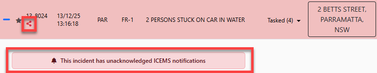
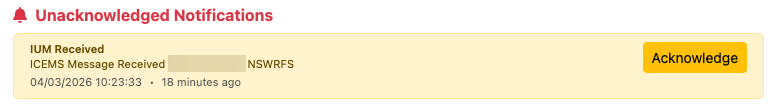
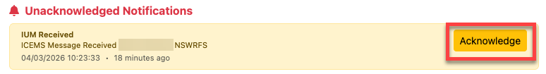

# ICEMS

> **Note:** ICEMS functionality in LAD is still in development and features are being added gradually. Confirm that actions taken within LAD work correctly.

## Unacknowledged IUMs

When there is an unacknowledged ICEMS notification, LAD flags it in several places.

### Alert

An [alert](interface.md#alerts) is shown in the top right of the Situation Map whenever ICEMS notifications are present.

### Incident Register

The ICEMS icon turns red on any incident with an unacknowledged IUM, and a red banner is shown on the expanded incident. Click the banner to open the [Incident Timeline](incident-register.md#incident-timeline).

The same indicators appear in the incident popup on the Situation Map.

### Incident Timeline

A warning is shown at the top of the Incident Timeline for any unacknowledged IUMs.

## Acknowledging an IUM

Click **Acknowledge** next to the unacknowledged IUM notification in the Incident Timeline.

