# Incident Register

The Incident Register is in the bottom left of LAD. It lists all filtered incidents. Each row displays:

- Incident ID, with up to three icons underneath:
  -  **Photos** — photos have been uploaded to the incident. Click to open the [photo library](#incident-photos).
  -  **Outstanding actions** — the incident has outstanding *action required* tags. If there's more than one, the number beside the thumbtack shows how many. Click to open the [Incident Timeline](#incident-timeline).
  -  **ICEMS** — the incident is linked to ICEMS; hover to see the ICEMS incident number. It turns red when there's an unacknowledged IUM. See [ICEMS](icems.md#unacknowledged-iums).

  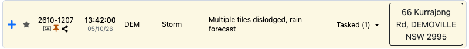
- Received date and time
- Assigned HQ
- Incident type
  - Flood rescue incidents also show the flood rescue category 1–5, e.g. a *Critical Assistance* (category 1) flood rescue shows as `FR-1`.
  - Flood support incidents show the sub-type, e.g. *Medical Resupply*.
- Status
  - When tasked, also shows the number of taskings (including completed, called off and untasked teams).
- Address
  - For geocoded incidents, click the address to focus the Situation Map on the incident.

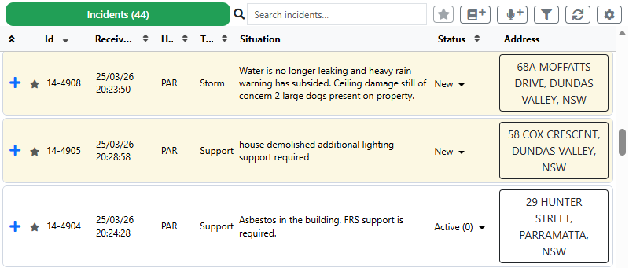

Each row's background colour shows the incident priority:

| Colour | Priority |
| --- | --- |
| White | General |
| Yellow | Priority |
| Blue | Immediate |
| Red | Rescue / life-threatening |

## Expanded Incident Details

Click anywhere on an incident row to expand it. The expanded view shows:

- Incident tags
- Outstanding *Action Required* tags — any outstanding notes with action tags. Tags with the same name are grouped with a count, e.g. *Further Action Required ×2*. Click a tag to open the [Incident Timeline](#incident-timeline), where you can [resolve](#action-required-tags--resolving-notes) the notes.

  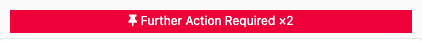
- Incident details, including the assigned sector
  - Click the current sector to choose a different one from a dropdown.
- Incident location details
- Caller details
- Contact details
- Taskings list — every team tasked to the incident, including teams outside your LAD team filters, and untasked, called off and completed teams.

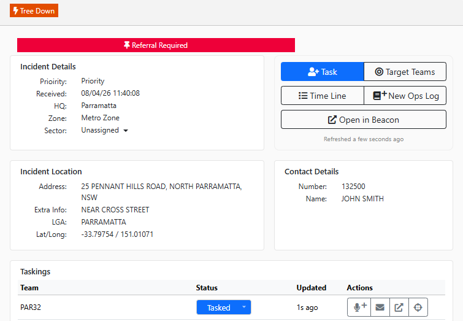

## Incident Actions

The expanded incident has five action buttons:

- **Task** — opens [Instant Task](common-functions.md#tasking-teams-instant-task).
- **Target Teams** — finds the closest teams and shows their straight-line distance to the incident.
- **Time Line** — opens the [Incident Timeline](#incident-timeline).
- **New Ops Log** — opens [New Ops Log](common-functions.md#new-ops-log).
- **Open in Beacon** — opens the incident in the Beacon remote tab.

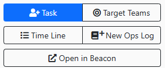

## Incident Taskings Actions

Each team in the incident's taskings list has the same four actions as in the Team Register:

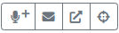

- **Radio Log** (against the incident) — opens [New Radio Log](common-functions.md#new-radio-log), logged against the incident and including the team's callsign.
- **Message Team** (against the incident) — opens [Send SMS](common-functions.md#send-sms) with the team members as recipients, associated with the incident.
- **Open in Remote Tab** — opens the team in the Beacon remote tab.
- **Focus on map** — focuses the Situation Map on the team's radio location, if matched.

Tasking statuses can be updated the same way as in the Team Register — see [Tasking Status](team-register.md#tasking-status).

## Incident Timeline

The Incident Timeline shows all ops log entries (notes), tasking status updates and incident status updates for the incident. It combines the *Notes* and *Incident Timeline* sections of the Beacon incident page.

It has three display modes:

- **Incident History** — incident status updates and tasking status updates.
- **Ops Log** — ops log entries (notes).
- **Both** — ops log entries and incident history together.

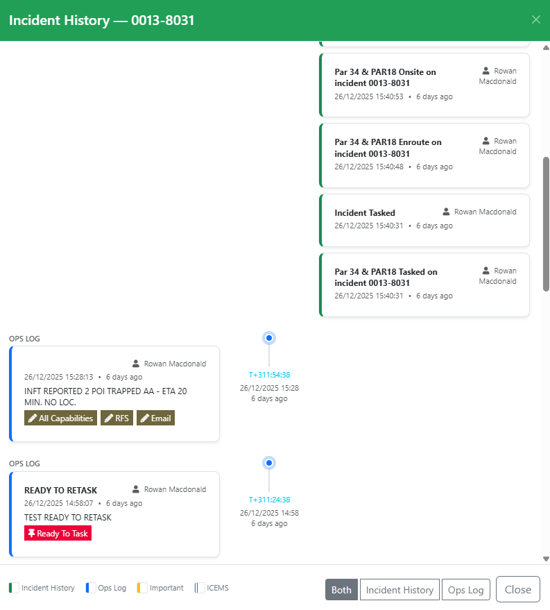

The timeline is sorted newest (top) to oldest (bottom). Entries are colour-coded to distinguish incident history, ops log entries, urgent ICEMS messages and non-urgent ICEMS messages.

Filter the ops log entries by selecting tags at the top of the timeline. This is an **AND** filter — entries are only shown when they contain **all** selected tags.

ICEMS functionality is covered in [ICEMS](icems.md).

### Action Required Tags & Resolving Notes

Notes with an outstanding *action required* tag show an **Action Required** label and a **Resolve** button.

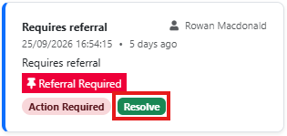

Click **Resolve**, enter the resolution notes (required) and click **Resolve** to resolve the note.

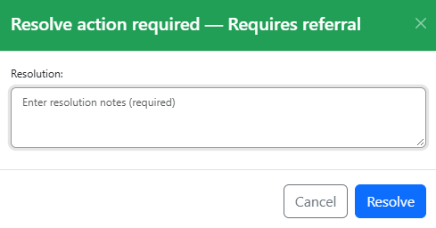

## Incident Photos

When photos have been uploaded to an incident, a photo icon appears under the incident ID in the register.

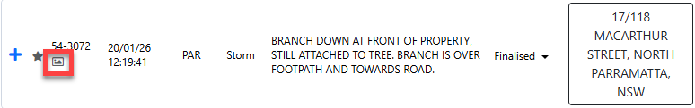

Click the photo icon to open the photo library for the incident. Use the thumbnails on the left to move between photos.

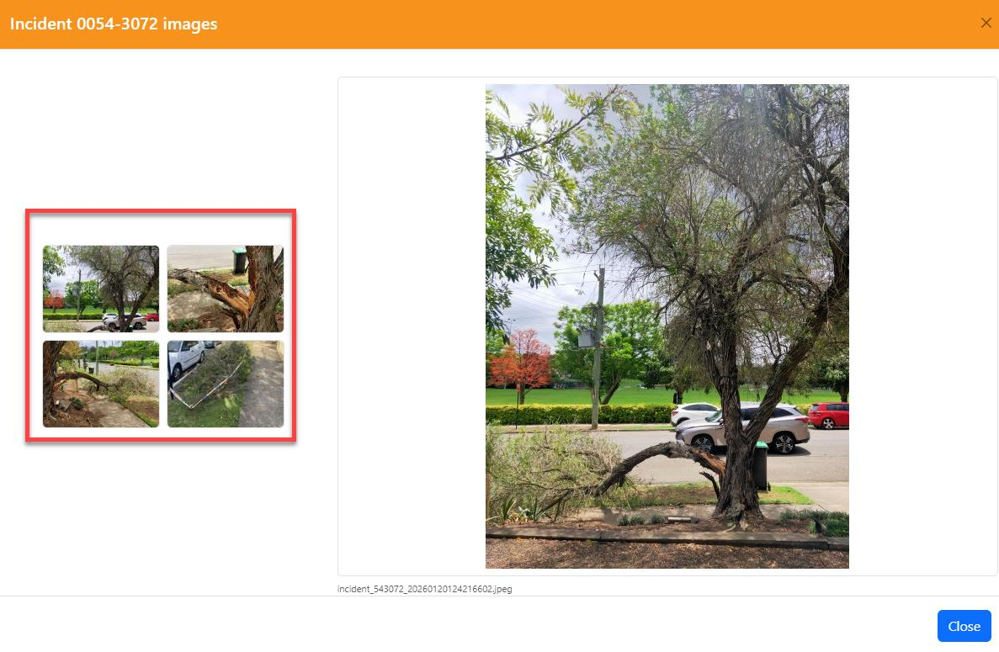
