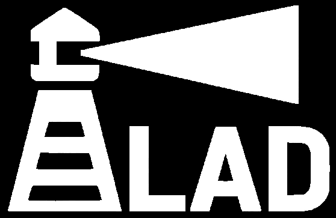
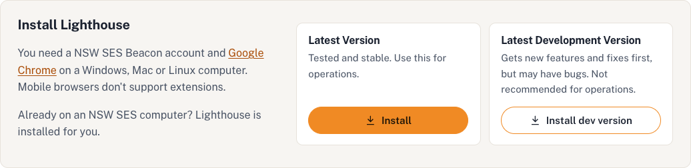

# Lighthouse Aided Dispatch (LAD)

## Purpose

Lighthouse Aided Dispatch (LAD) is Lighthouse's tasking and dispatching system. It is designed to give you more capability when managing incidents and tasking during emergency operations within Beacon.

LAD has been designed with three balanced guiding principles:

- Provide as much information as possible to support informed decision making.
- Allow as many actions as possible to be performed within LAD.
- An intuitive interface.

> **Note:** This guide may contain images from different versions of Beacon (Production/Live Beacon and Train Beacon). All functions should work identically in any version of Beacon, but the data available to LAD depends on which version of Beacon LAD is opened from.

> **Note:** Parts of this guide are AI generated and may contain hilarious errors. Screenshots showing "Demo City" use made-up data. If something here doesn't match what you see in LAD, trust LAD, and let us know on [GitHub](https://github.com/NSWSESMembers/Lighthouse/issues).

## Installing Lighthouse

Lighthouse should be automatically installed on all SES devices. If Lighthouse is installed, the **Lighthouse** navigation menu will be visible in Beacon.

If you are on a device that does not have Lighthouse installed, go to [lighthouse.ses.nsw.gov.au](https://lighthouse.ses.nsw.gov.au) and install either the latest version or the latest development version.

- **Latest Version**
  - Suitable for use in operations. This version is stable and is less likely to have bugs.
- **Latest Development Version**
  - Receives the latest updates to Lighthouse before they are published to the stable version. It is the first to receive new features and bug fixes, and is considered *unstable* as it may contain bugs that have not yet been identified and fixed.
  - The development version is not recommended for operational use. It is important to verify that Lighthouse functions are working as intended.

## Contents

1. [Getting Started](getting-started.md) — launching LAD, the remote Beacon tab and radio tracking
2. [Configuration](configuration.md) — data, filters, map markers, collaborative layers, layout, appearance and Instant Task suggestions
3. [Interface Overview](interface.md) — layout, register controls, alerts and the Trackable Assets Library
4. [Common Functions](common-functions.md) — Spotlight, starring, radio logs, SMS, ops logs and Instant Task
5. [Team Register](team-register.md)
6. [Incident Register](incident-register.md)
7. [ICEMS](icems.md)
8. [Situation Map](situation-map.md)
9. [What's New](https://lighthouse.ses.nsw.gov.au/whats-new/) — changes in each Lighthouse release
