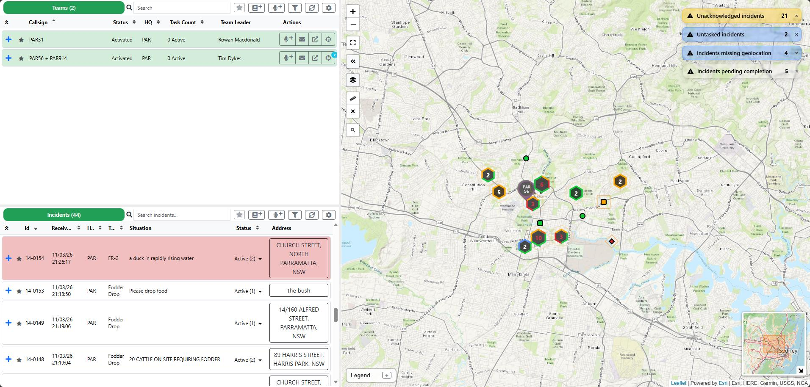
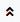
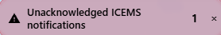
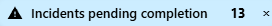
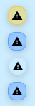
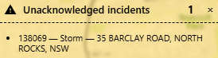
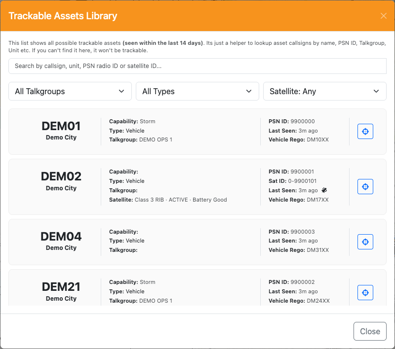
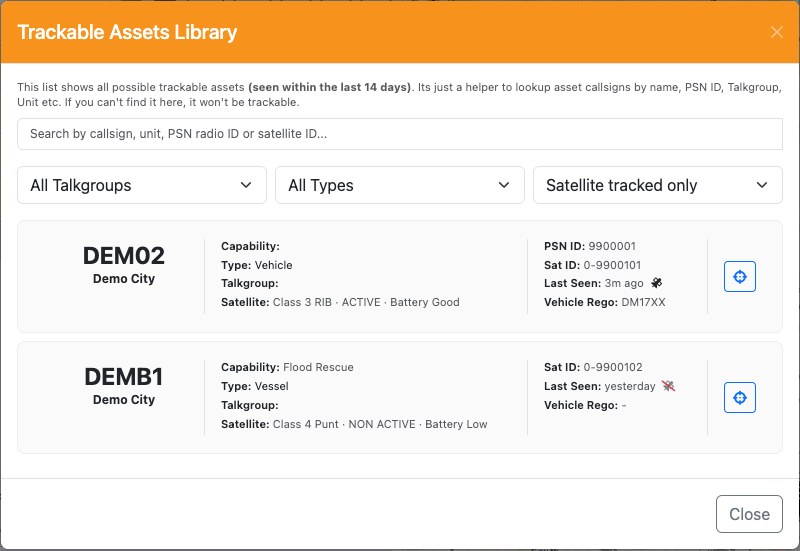

# Interface Overview

The LAD interface has two core components: the **side draw** and the **situation map**. The divider between them can be resized, and the side draw can be hidden completely for a full-screen map by clicking the **<<** button on the map. You can also choose a different arrangement under [Layout](configuration.md#layout).

**Side draw**

- **Team Register** (top) — lists all filtered teams and their taskings, with actions against those teams. See [Team Register](team-register.md).
- **Incident Register** (bottom) — lists all filtered incidents and their details, with actions against those incidents. See [Incident Register](incident-register.md).

**Situation Map**

- Displays all filtered incidents and teams, and allows actions to be taken against them. Layers are available to display additional map information. See [Situation Map](situation-map.md).

## Register Controls

The Team and Incident registers share a common set of controls:

- **Toggle Starred** — switches the register between all filtered incidents/teams and only [starred](common-functions.md#starring-incidents-and-teams) ones.
- **Toggle In Map View** — lists only the incidents/teams inside the current Situation Map view. See [Listing Only What's in the Map View](common-functions.md#listing-only-whats-in-the-map-view).
- **New Ops Log Entry** — opens the [New Ops Log](common-functions.md#new-ops-log) dialog. The entry is not automatically attached to an incident.
- **New Radio Log Entry** — opens the [New Radio Log](common-functions.md#new-radio-log) dialog. The entry is not automatically attached to a team or incident.
- **Filter Settings** — opens the filters relevant to that register (Teams or Incidents).
  - The Team Register filter dropdown also opens the [Trackable Assets Library](#trackable-assets-library). It can also be opened from the bottom of the Configuration tabs.
- **Refresh Data** — refreshes the data for that register. With [Live Updates](configuration.md#live-updates) on, it also flashes briefly whenever Beacon pushes a change for that register, so you can see updates arriving. Tasking changes flash both registers' buttons.
- **Page Configuration** (right) — opens the [Configuration](configuration.md) screen.

Each register also has a **collapse all** button  that collapses every team or incident in that register.

## Alerts

Alerts display in the top right corner of LAD under certain conditions:

- **Unacknowledged Incidents** — all filtered incidents in the *New* status.

  

- **Untasked Incidents** — all filtered incidents in the *Active* status that have no taskings.

  

- **Unacknowledged ICEMS** — all filtered incidents with an unacknowledged ICEMS message. See [ICEMS](icems.md).

  

- **Incidents Pending Completion** — incidents where all teams have completed but the incident is still active. This flags incidents that can potentially be closed if no further action is required.

  

- **Incidents missing geolocation** — incidents created without a geocoded (GPS) address. These are not displayed on the map.

  

### Managing Alerts

Minimise an alert by clicking the cross on its right. Minimised alerts show as small icons and can be re-opened at any time — minimising does not dismiss the underlying alerts. An alert automatically re-appears if another incident meets its condition, e.g. a new unacknowledged ICEMS message.

To have alerts start minimised, turn on **Auto-collapse alert popups** under [Appearance](configuration.md#appearance).

### Selecting Alerts

Click the incident text in an alert to select that incident in the Incident Register and focus the Situation Map on it.

## Trackable Assets Library

The Trackable Assets Library lists every SES asset that has reported a location in the last 14 days, from PSN radios and satellite trackers. Use it to confirm an asset's details — most commonly, finding the programmed radio name (for [team tracking](getting-started.md#setting-up-a-team-for-radio-tracking)) by searching for the PSN ID.

Open it from the filter dropdown in the Team Register, or from the **Trackable Asset Library** link at the bottom of the [Configuration](configuration.md) tabs. The Configuration link saves and closes Configuration first, the same as **Close**.

Each entry displays:

- Asset callsign (the name programmed into the radio)
- Assigned HQ
- Capability
- Type
- Current talkgroup
- PSN radio ID
- Time last seen
- Vehicle registration (where applicable)
- For assets with a satellite tracker: the satellite ID, and a **Satellite** line with the tracker's class, status and battery. Hover over the satellite ID to see the tracker's equipment ID.

### Searching and Filtering

Search by callsign, unit or zone name, PSN ID, satellite ID or satellite equipment ID using the field at the top. The dropdowns below it narrow the list by **Talkgroup**, **Type** (e.g. Vehicle or Vessel) and **Satellite** (satellite tracked only, or no satellite tracker).

### Satellite-Tracked Assets

If an asset's location comes from a satellite tracker, a satellite icon  shows next to the time it was last seen. The icon is crossed out  if the tracker's status isn't **ACTIVE** — its last reported location may be out of date. A battery the tracker reports as needing replacement shows as **Low**.

### Showing an Asset on the Map

Click the **Show on map** button  on an entry to close the library, focus the Situation Map on that asset and open its popup. LAD turns on the asset layer it needs if it's off (see [Overlays](situation-map.md#overlays)):

- An asset matched to a team that's in the Team Register is on the **Matched against Teams** layer.
- Any other asset is on the **Unmatched against Teams** layer. That layer can slow LAD down, so turn it off again from the **Layers** menu when you've finished. The button is greyed out for assets without a location.
