# Situation Map

The Situation Map is on the right of the screen (by default — see [Layout](configuration.md#layout)). It displays all filtered incidents and matched teams, giving you a visual picture to support tasking and decision making.

The different kinds of map content — incidents, collaborative layer markers, assets (radios and satellite trackers), overlay icons and overlay polygons (areas) — are stacked in a set order, with higher layers drawn over lower ones. The order is set under [Marker Layer Order](configuration.md#marker-layer-order); by default incident markers are always drawn on top.

## Incident Clustering

Incidents can be clustered to make them easier to access and to deal with overlapping addresses. Clustering is enabled by default and happens in two situations:

- **Incidents at the same address / GPS location** — stops incidents being missed when they're stacked on top of each other. The cluster shows how many incidents are at the location.
- **Incidents close together** — as you zoom out, incidents within a set distance of each other are grouped to keep the map readable.

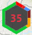

Clusters display as a hexagon. The number inside is the number of incidents in the cluster; a **red** number means at least one is a rescue incident.

The border works like a pie chart of incident priorities, using the same colours as the [Legend](#legend). For example, a cluster of 20 incidents with a border that is half green, a quarter blue and a quarter yellow contains 10 general, 5 immediate and 5 priority incidents.

Clustering settings are under [Incident Marker Clustering](configuration.md#incident-marker-clustering).

## Incident Status on Markers

When enabled under [Map Markers](configuration.md#incident-status-on-markers) (on by default), extra indicators are drawn on incident markers:

| Indicator | Meaning |
| --- | --- |
|   | **Unacknowledged** — a pulsing yellow circle. Also shown on a cluster that contains an unacknowledged incident. |
|  | **Active** (not tasked) — a rotating purple dotted ring. |
| — | **Tasked** — no extra indicator. |
|  | **Referred, Complete or Finalised** — a black diagonal line through the icon. |
|  | **Cancelled or Rejected** — a black cross through the icon. |
| 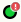 | **Action Required** — a red exclamation mark when the incident has an outstanding action required tag, whatever its status. |

## Overlapping Asset Markers

When you're zoomed in to street level (zoom 15 by default), asset markers that would otherwise sit on top of each other spread out so every vehicle can be seen and clicked:

- **Swing around.** A marker that's in the way swings around its vehicle's position. Its point still sits exactly on where the vehicle is.
- **Move out on a line.** Where there isn't room to swing around, such as a yard with several vehicles parked together, the marker moves out to a clear spot. It becomes a circle, with a line back to a small dot where the vehicle is. Lines don't cross each other, and avoid running over other markers and dots.

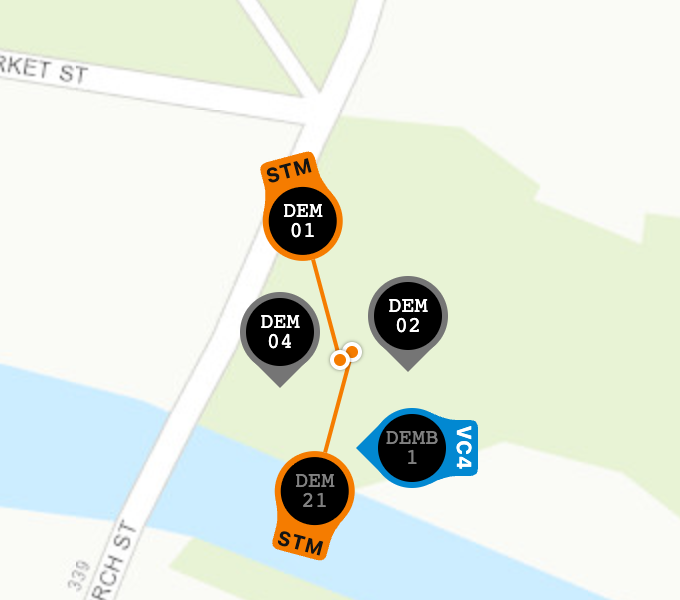

- Hover over a marker to bring it to the front and highlight it, along with its line and dot.
- While a vehicle's popup is open, from clicking its marker or using **Show on map**, its marker stays on top and highlighted, and the popup opens over the marker wherever it has moved to.
- As vehicles move, markers slide smoothly out of each other's way, and markers that aren't moving hold their places.
- Zoomed further out, markers overlap as normal. Zoom in to separate them.

This can be turned off, and the zoom level and lines changed, under [Map Markers](configuration.md#overlapping-markers).

## Asset Breadcrumb Trails

While a vehicle's popup is open, from clicking its marker or using **Show on map**, a breadcrumb trail shows where it has recently been. The trail is a line through its last reported positions in the marker's colour, with a dot at each position. It fades the older it gets, so you can see which way the vehicle came and roughly when.

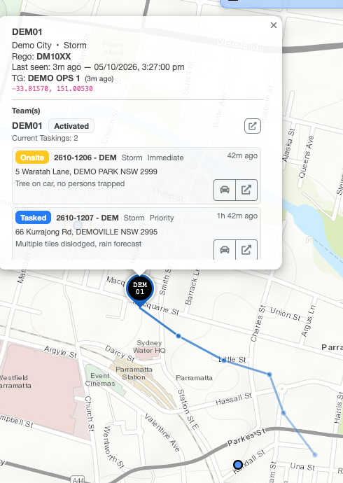

- The trail covers the last **30 minutes** by default. Older positions drop off as they fade.
- Vehicles report their position every few minutes, so the line joins one report to the next in a straight line. It shows the direction and rough path of travel, not the exact roads taken.
- Positions are recorded for every vehicle while LAD is open, so selecting any vehicle shows its recent travel. Trails only go back to when LAD was opened, and they're kept only in your browser.
- A vehicle that stays put has no trail. When it moves again, the trail starts from where it was parked.

The trail can be turned off, and its length changed, under [Recent Travel](configuration.md#recent-travel).

## Map Control

### Zoom

Use the **+** and **−** buttons in the top left, or the mouse wheel.

### Panning

Click and hold the left or middle mouse button and drag.

### Minimap

The minimap in the bottom right shows the current view in context of the wider area, and can be dragged to move the map. Hide or expand it with the arrow in its bottom right corner.

### Hiding All Popups

Hold <kbd>Space</kbd> to temporarily hide all popups; release to bring them back.

### Measuring Tool

Measure distances between multiple points. Several separate measurements can be on the map at once.

1. Click the ruler icon on the left of the map.
2. Click two or more points. The distance between each pair of markers is shown in green, and the total in blue.

- <kbd>Shift</kbd> + click a marker to delete it.
- Press <kbd>Esc</kbd> to start a new set of markers.
- Click the ruler icon again, or press <kbd>Esc</kbd> twice, to turn the tool off.
- The **X** icon under the ruler clears all measurements.

### Address Search

Open Address Search by right-clicking the map and choosing **Address Search**, or with the search tool  in the map controls.

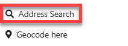

Type an address and results appear automatically. Select a result or press <kbd>Enter</kbd> to go to that address.

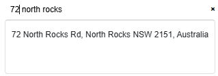

### Creating Incidents from the Map

You can create an incident from a map location using reverse geocoding.

1. Right-click the location and choose **Geocode here**.

   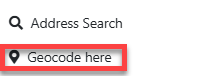

2. The map shows the nearest mappable addresses. Your selected location is a **red** pin and the found addresses are **blue** pins. Clicking anywhere else on the map cancels the search.

   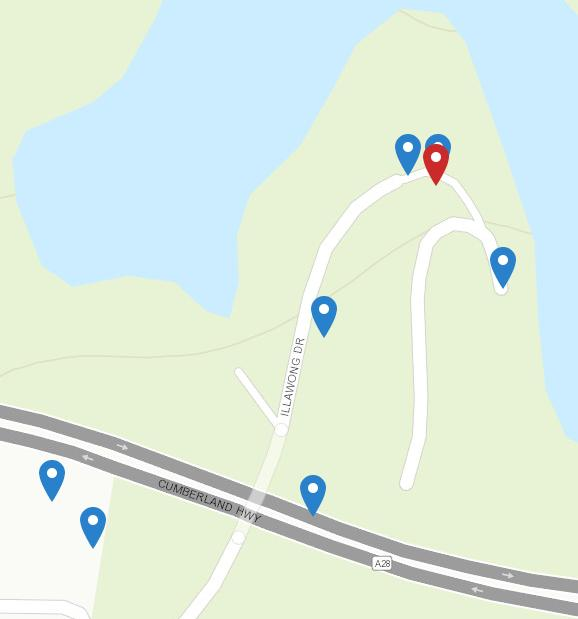

3. Click a blue pin to see the address, its distance from your red pin, the address type (e.g. *PointAddress* or *Street*), the area and the GPS coordinates.

   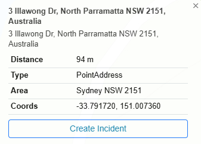

4. Click **Create Incident** to open Beacon's *Create New Incident* page in your [remote tab](getting-started.md#remote-beacon-tab) with the address pre-filled, then create the incident as normal.

## Layers

Layers control what is shown on the map. Open the Layers menu with the layer button  in the top left of the map.

### Basemap

The basemap is the underlying street or imagery map. The default is **Esri Topographic**; basemaps are available from Esri, Spatial NSW and SIX Maps, covering both street and satellite imagery.

Not all basemaps have data at every zoom level. If you zoom in beyond what the selected basemap supports, Esri Topographic is shown until you zoom back out.

To change basemap, open the **Layers** menu, open the basemap dropdown and pick one.

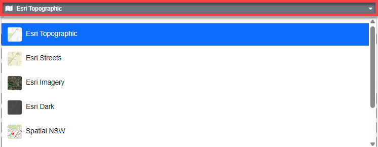

### Overlays

Overlays sit on top of the basemap to add information. Toggle them on and off in the Layers menu, or use the search bar at the top to find a layer. Many overlay features show more detail when clicked — e.g. clicking a HazardWatch warning shows the full warning.

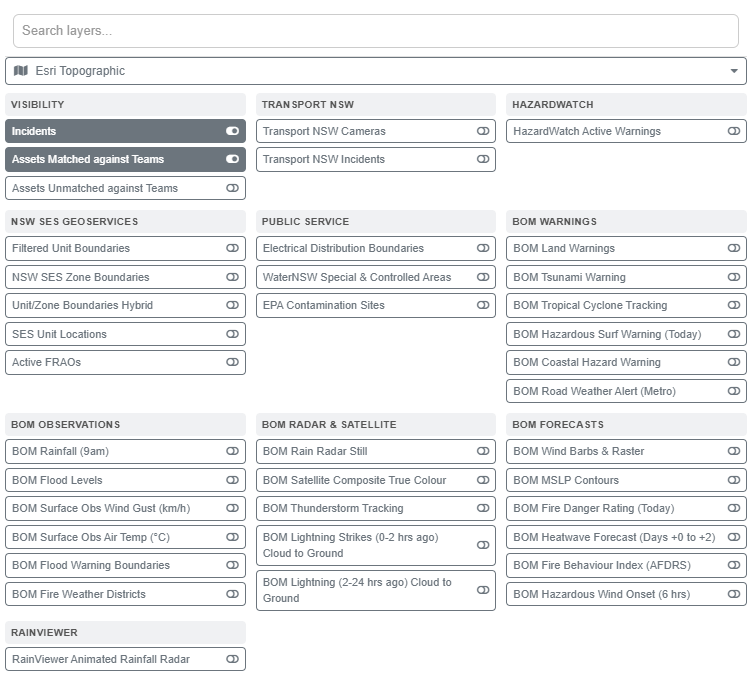

Most layers are described by their name. Those that need more explanation:

**Assets**

- **Matched against Teams** — radios and satellite trackers matched to a team. Only those that have reported a location in the last 24 hours are shown.
- **Unmatched against Teams** — radios and satellite trackers not matched to a team, shown with grey text. Icons are faded if the asset hasn't reported in the last hour.
  - This layer can slow LAD down and shouldn't be left on.

**NSW SES Geoservices**

- **Filtered Unit Boundaries** — a pink outline around your filtered headquarters.
- **NSW SES Zone Boundaries** — SES zone boundaries.
- **Unit/Zone Boundaries Hybrid** — SES zone and unit boundaries.
- **SES Unit Locations** — the location of every SES unit headquarters.
- **Active FRAOs** — active FRAO declarations, from the Beacon FRAO register.

**HazardWatch**

- **HazardWatch Active Warnings** — flood, tsunami, severe weather, coastal erosion and snow warnings. Click a warning to see the published product details. Refer to the Public Information Manual for more on warnings.

## Legend

The legend is in the bottom left of the map and explains the icons shown — incident shapes and priority colours, flood rescue categories, job status indicators, overlays and asset types. Each asset type is listed with its marker colour and its capability code (see [Capability Codes](configuration.md#capability-codes)). It can be hidden and re-opened at any time.

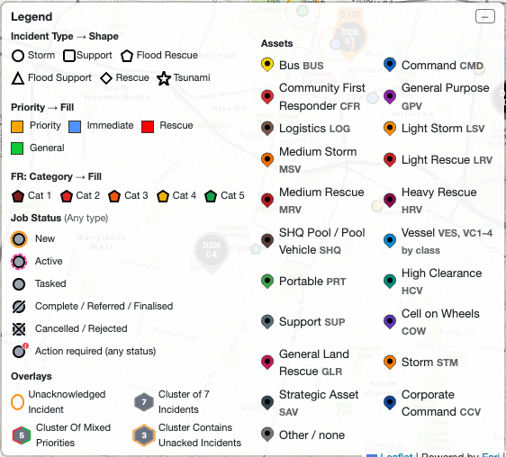

## Collaborative Map Layer

Collaborative map layers let users place markers on the map that other users can see. Create or subscribe to a layer under [Collaborative Layers](configuration.md#collaborative-layers) in the Configuration screen, then make it visible from the **Layers** menu.

### Adding a Marker

1. Right-click the map and choose **Add marker to collaborative layer**.

   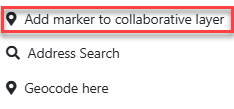

2. If you're subscribed to more than one layer, choose the layer to add the marker to.

   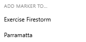

3. Choose the marker icon and colour, enter a title and description, and click **Save**. Actions on markers are logged to the Ops Log.

   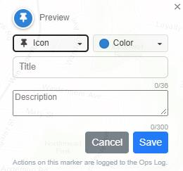

### Viewing and Changing a Marker

Click a marker to open it and see its details and comments.

- Use **Edit** or **Delete** to change or remove the marker.
- To comment, type in the comment field and click **Comment**.

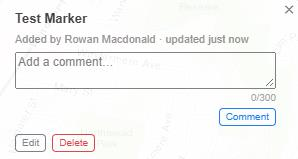

## Incidents

All filtered incidents are shown on the map, with shape and colour depending on incident type and priority. Clicking an incident opens its popup and selects it in the Incident Register.

The popup shows:

- Incident ID
- Type and status
- Priority
- Outstanding *Action Required* tags, grouped with a count when the same tag appears more than once (e.g. *Further Action Required ×2*). Click a tag to open the incident's timeline.
- Address
- Situation
- Incident tags
- Tasked teams
- Date and time received
- Assigned HQ

Close the popup with the cross in its top right, or by clicking elsewhere on the map. When your mouse moves off the popup it becomes slightly transparent so you can see the map behind it.

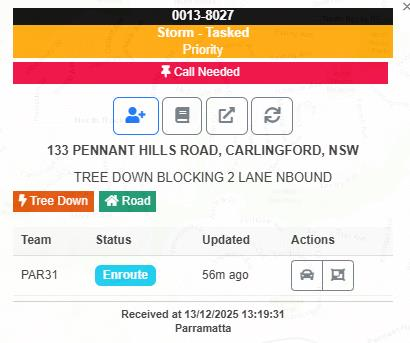

### Hovering over an Incident

Hover over an incident marker to see a quick summary without opening its popup:

- Incident ID, priority and type (including the flood rescue category, e.g. `FR-1`)
- Address
- Situation on scene
- Status and assigned HQ
- ICEMS agencies involved, each with a coloured dot for its status. Hover over an agency to see its status in words.
- Outstanding *action required* tags: the first tag, plus how many more (e.g. *Call Made +1*)

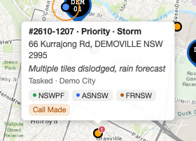

| Dot colour | Agency status |
| --- | --- |
| Green | On scene / responded |
| Blue | En route |
| Teal | Acknowledged / will attend |
| Amber | Requested / sent |
| Grey | Left scene / closed |
| Red | Will not attend / timed out |

> **Note:** ICEMS agencies appear once LAD has loaded them for that incident, which happens when you expand the incident in the register or when Beacon pushes an ICEMS update.

### Incident Popup Actions

**Incident details section**

- **Task Team** — opens [Instant Task](common-functions.md#tasking-teams-instant-task).
- **Incident Timeline** — opens the [Incident Timeline](incident-register.md#incident-timeline).
- **New Ops Log Entry** — opens [New Ops Log](common-functions.md#new-ops-log).
- **Open Incident in Remote Tab** — opens the incident in the Beacon remote tab.
- **Refresh Incident** — reloads the incident's details, including tasked teams and their statuses.

**Incident taskings section**

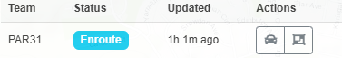

- **Team row** — click to zoom to the team's location (if available).
- **Team status** — click to change the tasking status, as in the [registers](team-register.md#tasking-status).
- **Route to Asset** (left button) — shows a road route from the team's current location to the incident with an approximate ETA.
- **Fit Bounds** (right button) — zooms in as far as possible while keeping both the team and incident in view.

## Teams

The map shows team locations using the position reported by the team's matched radio or satellite tracker — the GPS in an SES-issued PSN radio, or a satellite tracker fitted to the asset (see [Satellite-Tracked Assets](interface.md#satellite-tracked-assets)). Personal phones and non-SES radios aren't tracked. The register *focus* buttons can only zoom to teams that are on the map.

Click an asset marker to see the radio or satellite tracker's details — such as when it was last seen — the team it's matched to, and that team's taskings. If the location comes from a satellite tracker, a satellite icon shows next to the last-seen time (crossed out if the tracker isn't active), with a **Satellite** line giving the tracker's class, status and battery — see [Satellite-Tracked Assets](interface.md#satellite-tracked-assets). Each tasking has two buttons:

- **Route to Asset** (left) — shows a road route from the team's current location to the incident with an approximate ETA.
- **Open Incident in Remote Tab** — opens the incident in the Beacon remote tab.

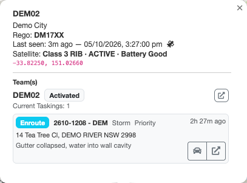
