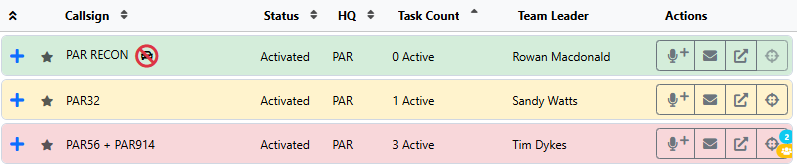
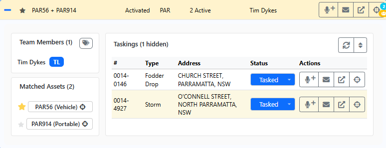
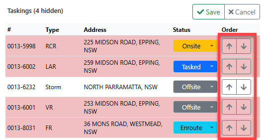
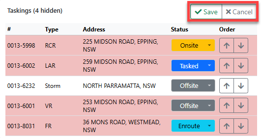
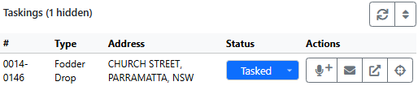
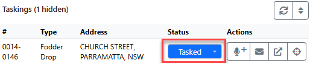

# Team Register

The Team Register is in the top left of LAD. It lists all filtered teams. Each row displays:

- Callsign
- Status
- HQ (assigned HQ)
- Task count — current active taskings (Tasked, Enroute, Onsite and Offsite)
- Team leader

Sort by Callsign, Status, HQ or Task Count by clicking the column heading; click again to swap between ascending and descending.

Each row's background colour shows the team's current tasking load, so you can quickly spot teams that are (or will soon be) available, teams that may be overloaded, or teams yet to complete their taskings in Beacon:

| Colour | Active taskings |
| --- | --- |
| Green | None |
| Yellow | 1–2 |
| Red | More than 2 |

> **Note:** The task count includes taskings to incidents outside your LAD incident filters (e.g. local storm incidents when your filter is set to flood rescues only).

If a team can't be matched to a radio asset, a car icon with a cross through it shows next to its callsign and the map focus button is disabled. See [Setting up a Team for Radio Tracking](getting-started.md#setting-up-a-team-for-radio-tracking).

## Expanded Team Details

Click anywhere on a team row to expand it. The expanded view lists team members (including the team leader) and the team's taskings.

The taskings list is filtered by the **Tasking Status** filter and shows all matching taskings, including incidents outside your incident filter. By default this is Tasked, Enroute, Onsite and Offsite.

### Matched Assets

The bottom left of the expanded view lists each matched radio asset. Click one to zoom to it on the Situation Map.

The **primary matched asset** is marked with a gold star. It is used to locate the team for features such as Instant Task (which takes distance into account) and for driving routes from the team to an incident.

Change the primary asset by clicking the star next to another asset. This is synced to all LAD users on their next refresh cycle.

### Toggle Member Capability

Show or hide member capabilities with the tags icon to the right of the **Team Members** heading. Hidden by default.

## Team Row Actions

Each team row has four action buttons:

- **Radio Log** — opens [New Radio Log](common-functions.md#new-radio-log) against the team.
- **Message Team** — opens [Send SMS](common-functions.md#send-sms) with the team members as recipients. Greyed out if the team has no members.
- **Open in Remote Tab** — opens the team's edit page in the Beacon remote tab, e.g. to change the team's name or members.
- **Focus on map** — focuses the Situation Map on the team's radio location. Greyed out if no radios are matched.
  - If multiple radios are matched, the button shows the count and toggles between them on each click.
  - If one radio is matched to multiple teams, a yellow group icon is shown.

<!-- TODO: screenshot of the team row action buttons -->

## Team Taskings

The Team Taskings section lists incidents tasked to the team that are within your LAD filters and tasking statuses. If the team has taskings outside your filters, a **(x hidden)** count appears next to the **Taskings** heading.

### Refresh

Click **Refresh** to reload the team's tasking details.

### Reordering Taskings

1. Click the reorder button to enter reordering mode.
2. Use the up and down arrows next to each tasking to change the order.

   

3. Click **Save** to confirm, or **Cancel** to discard your changes.

   

## Team Tasking Actions

Each tasking under a team has four actions:

- **Radio Log** (against the incident) — opens [New Radio Log](common-functions.md#new-radio-log), logged against the incident and including the team's callsign.
- **Message Team** (against the incident) — opens [Send SMS](common-functions.md#send-sms) with the team members as recipients, associated with the incident.
- **Open Incident in Remote Tab** — opens the incident in the Beacon remote tab.
- **Focus on map** — focuses the Situation Map on the incident if it is geocoded and within your incident filters. Greyed out if the incident is outside your filters (it won't be on the map).

## Tasking Status

Each tasking shows its status. Click the status to open a dropdown and choose a new one. Some statuses need extra information:

- **Remove Tasking** — only available in the *Tasked* status. Removes the tasking from the team.
- **En-Route** — requires a time, defaulting to now (tick the override to enter your own). You can set an ETA; the quick ETA buttons add increments, and when the ETA is blank they add to the time set.
- **Call Off** — requires a reason.
- **On-Site** — requires a time, defaulting to now (tick the override to enter your own). You can set an ETC; the quick ETC buttons work the same way as quick ETA.
- **Off-Site** — requires a time, defaulting to now (tick the override to enter your own).
- **Complete** — opens Beacon's *Team Completion* dialog for the team in the remote tab.

